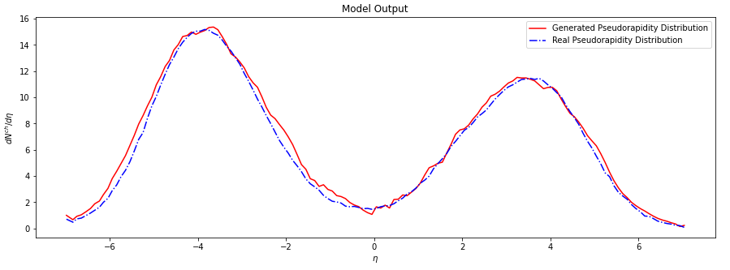
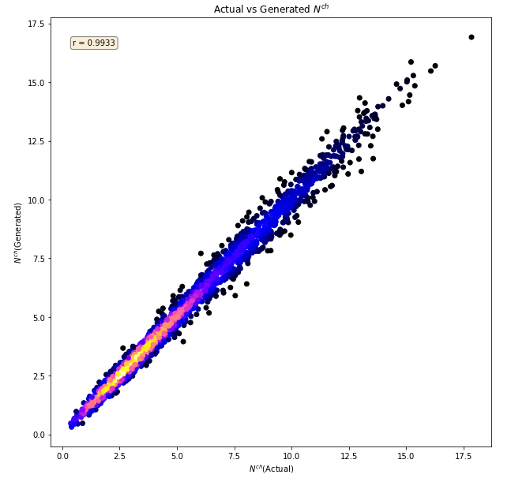

# Hydro-ML

The goal of this project is to replace the need for classical hydrodynamic simulation of Quark-Gluon Plasma to infer certainly
properties by converting initial state baryon distributions into final state net proton rapidity distributions using machine learning.

### Modules
This project contains a few Jupyter notebooks. The format adheres to the following naming scheme: 
- `{model_name}_train.ipynb`: This will contain the code required to train the model relating to the specific model. The model weights will be saved to a file that corresponds to the model name. For example, the `baryons` model's weights will be named `baryons_model.pt`. 
- `{model_name}_inference.ipynb`: This notebook will load the model saved from the training notebook. These notebooks are for inference only and will not train the model.

### Prerequisites
- [Jupyter](https://jupyter.org/)
- [Pytorch](https://pytorch.org/)
- [Matplotlib](https://matplotlib.org/)
- [Numpy](https://numpy.org/)
- [Scipy](https://scipy.org/)

### Use
To get started, you need to place the data you would like to run in the same folder as the Jupyter notebooks. Then,
depending on the format of your data, you may need to create your own import method. The `Dataset` class has you covered. 
All you need to do is override the constructor to specify your own data import  method. 
```python
# Example of custom data class:
class EnergyDensityDataset(Dataset):
    def __init__(self, data_folder, standardize=False):
        dE_deta_initial = np.loadtxt(f'./Datasets/{data_folder}/dE_detas_initial')
        dNch_deta_final = np.loadtxt(f'./Datasets/{data_folder}/dET_deta_final')

        self.start_eta = dE_deta_initial[0:1].flatten()
        self.final_eta = dNch_deta_final[0:1].flatten()

        self.initial = np.array( dE_deta_initial[1:], dtype=np.float64 )
        self.final = np.array( dNch_deta_final[1:], dtype=np.float64 )

        if standardize:
            self.initial = ((dE_deta_initial - np.mean(dE_deta_initial, axis=0)) / (
                        np.std(dE_deta_initial, axis=0) + 1e-16))
            self.final = ((dNch_deta_final - np.mean(dNch_deta_final, axis=0)) / (
                        np.std(dNch_deta_final, axis=0) + 1e-16))
```

For the rest of the code to work, it expects to have some initial eta, final eta, and of course the initial and final data.
To combine multiple datasets, the addition operator has been implemented. It is as simple as the following:
```python
dataset = EnergyDensityDataset('dE_data') + EnergyDensityDataset('dE_data_2')
```
**Please note that you must have data of the same type!**

The training loop follows Pytorch convention using the DataLoader class. 
```python
data_loader = torch.utils.data.DataLoader(
    dataset=dataset,
    batch_size=batch_size,
    shuffle=True,
)
```
For training, using batch size is a good idea, however, when attempting to use the inference notebook, no batch size will be better
as you can work with each inference instead of a batch of them.

You can now run the main loop by enumerating over the `data_loader` list.

### Data Analysis
There are two different `trim` functions. The first `trim` function is a part of the Data class. Calling this function
will trim down the dataset to the desired eta range.
```python
dataset = EnergyDensityDataset('dE_data').trim(-4.9, -4.) + EnergyDensityDataset('dE_data_2').trim(-4.9, -4.)
```
This will give us a dataset where only values from eta -4.9 to -4.0 will be included. 

The next trim function will trim your results, so if you only want to look at one specific domain, you can 
call `utils.trim()`
```python
_, dNch_detas_final_trim = utils.trim(dataset.final_eta, dNch_detas_final.numpy(), -4.9, -4.)
x_axis, output_trim = utils.trim(dataset.final_eta, output.detach().numpy(), -4.9, -4.)
```

Plotting is very simple. There are three plot functions. The first is `plot_telemetry` which should be called during the 
training loop to have a visual of the training progress as well as the model output. This should **not** be run unless
needed.

Second is the `plot_output` function which will show you the actual vs generated output of the model.



The third is the `plot_cc_graph` which will graph the correlation plot.


